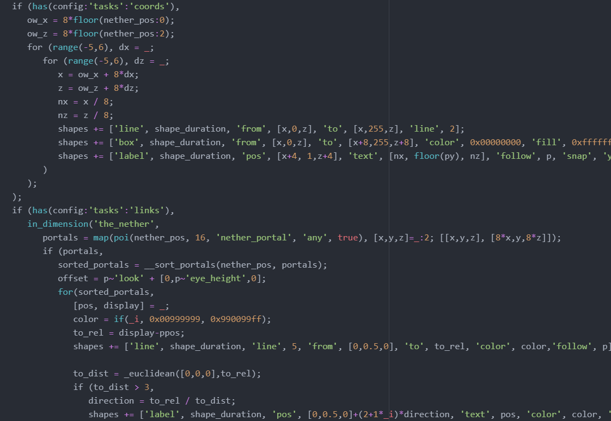
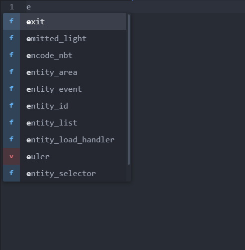
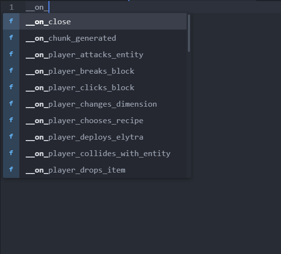

# Scarpet syntax highlighting and autocompletion for Atom

## Installation

Install the [scarpet-language](atom://settings-view/show-package?package=language-scarpet) package.

Now any file with `.sc` or `.scl` will open with Scarpet syntax highlighting and autocompletion by default.

## Need help?

Message me on Discord:

`replaceitem#9118`

## Preview

